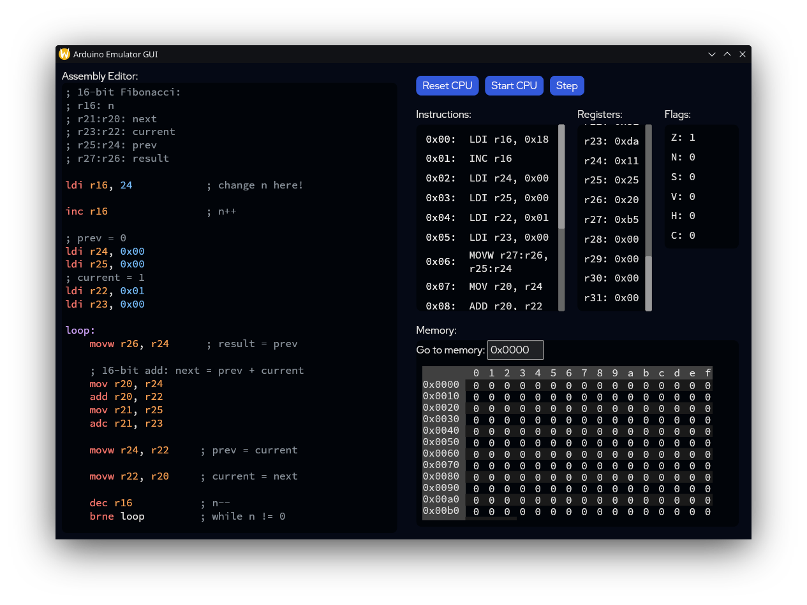

# ardemu

Try it out in the browser! (limited gui)
[peanutt42.github.io/ardemu_web](https://peanutt42.github.io/ardemu_web)



## Sample: Fibonacci Sequence
`fib.asm`:
```asm
; r16 is n
; r17 is n1
; r18 is n2
; r19 is n3
; r20 is result

ldi r17, 0                  ; n1 = 0
ldi r18, 1                  ; n2 = 1

inc r16                     ; n++

loop:                       ; while n > 0
    mov r20, r17            ; result = n1
    mov r19, r17            ; n3 = n1
    add r19, r18            ; n3 += n2
    mov r17, r18            ; n1 = n2
    mov r18, r19            ; n2 = n3
    dec r16                 ; n--
    brne loop               ; if n > 0, continue

; result is in r20
```

`main.rs`:
```rust
use ardemu_asm_parse_macro::include_asm;
use ardemu_core::{
	Cpu, CpuStatus,
	Register::{R16, R20},
};

fn main() {
	let mut cpu = Cpu::new(include_asm!("src/fib.asm"));

	let n = 10;

	cpu.write_register(R16, n);

	while matches!(cpu.step(), Ok(CpuStatus::Normal)) {}

	let result = cpu.read_register(R20);

	assert_eq!(result, 55);
}
```

## Resources
- [Atmel AVR Instruction Manual](https://ww1.microchip.com/downloads/aemDocuments/documents/MCU08/ProductDocuments/ReferenceManuals/AVR-InstructionSet-Manual-DS40002198.pdf): main source of reference material for AVR instruction set and expected behaviour
- [AVR Instruction Set WIKI](https://en.wikipedia.org/wiki/Atmel_AVR_instruction_set): simple, quick overview
- [simavr](https://github.com/buserror/simavr/): emulation implementations of low level arithmetic instructions and handling of their cpu flags